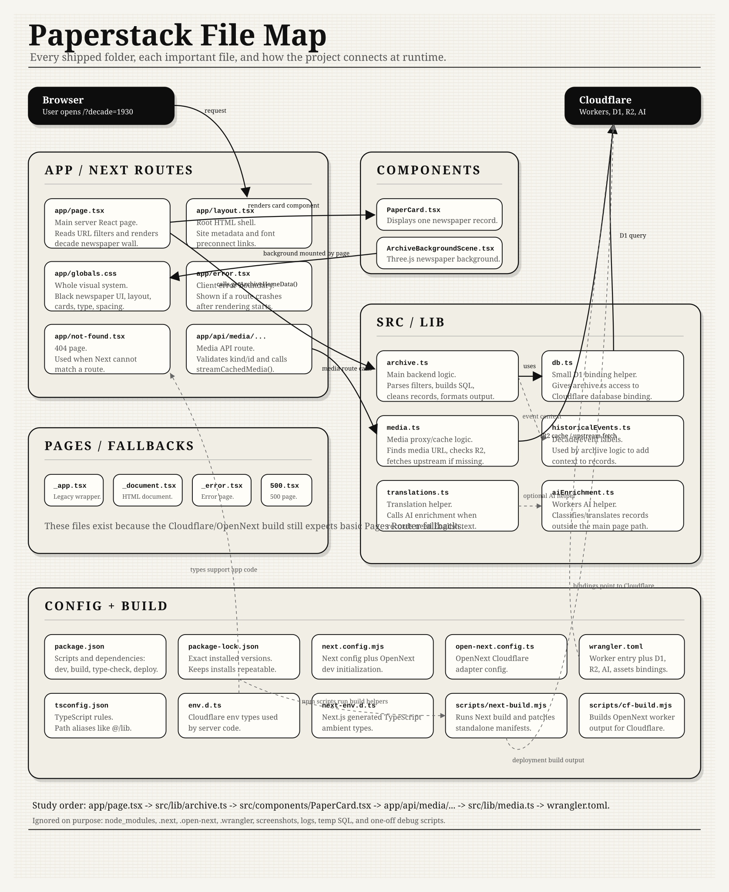

# Paperstack

Paperstack is a small archive browsing app.

It shows historical newspaper records by decade. The app reads metadata from Cloudflare D1, shows the records with React components, and serves image/media files through a cached API route.

Live site:

https://paperstack.yrasool.workers.dev

## Project Diagram

Open this first if you want the whole project in one picture:



## What This Uses

- Next.js App Router for pages and API routes.
- React components for the archive UI.
- TypeScript for safer data shapes.
- Cloudflare Workers through OpenNext.
- Cloudflare D1 for archive metadata.
- Cloudflare R2 for cached media.
- Three.js for the moving archive/newspaper background.

## How The App Works

```text
Browser
  -> app/page.tsx
  -> src/lib/archive.ts
  -> Cloudflare D1
  -> src/components/PaperCard.tsx
  -> app/api/media/[kind]/[archiveId]/route.ts
  -> src/lib/media.ts
  -> R2 cache or original archive image URL
```

The page does not hardcode the archive cards. It asks `src/lib/archive.ts` for data. That file builds the filters, runs SQL against D1, cleans the text, formats dates, removes weak records, and returns data the React page can render.

Images do not go straight from the browser to every archive source. The browser asks the local API route for media. The media route checks R2 first. If the file is not cached, it fetches the original image, stores it in R2, and streams it back.

## Folders

| Folder | Purpose |
| --- | --- |
| `app/` | Next.js App Router pages, global styles, and API routes. |
| `app/api/media/[kind]/[archiveId]/` | API route that serves cached newspaper/image/video media. |
| `src/components/` | React UI components used by the current page. |
| `src/lib/` | Backend/data logic used by the app. SQL, media caching, formatting, and enrichment helpers live here. |
| `pages/` | Small legacy Next.js fallback pages used by the Cloudflare/OpenNext build. |
| `scripts/` | Build helpers for Next.js and Cloudflare output. Temporary debug scripts are ignored. |

## Important Files

| File | What It Does |
| --- | --- |
| `app/page.tsx` | Main archive page. Reads URL filters, gets archive data, and renders the page. |
| `app/layout.tsx` | Root layout and basic site metadata. |
| `app/globals.css` | Main styling for the newspaper/archive look. |
| `app/api/media/[kind]/[archiveId]/route.ts` | Server route for media requests. Calls `streamCachedMedia`. |
| `src/lib/archive.ts` | Main data file. Builds SQL filters, reads D1, formats records, and prepares cards. |
| `src/lib/media.ts` | Media proxy and cache logic. Reads/writes R2 and fetches original archive files. |
| `src/lib/db.ts` | Small helper for getting the Cloudflare D1 binding. |
| `src/lib/historicalEvents.ts` | Event labels and matching logic used for archive context. |
| `src/lib/translations.ts` | Simple text/language helpers. |
| `src/lib/aiEnrichment.ts` | Workers AI helper code for enrichment/classification work. |
| `src/components/PaperCard.tsx` | Card for a newspaper record. |
| `src/components/ArchiveBackgroundScene.tsx` | Three.js background animation. |
| `scripts/next-build.mjs` | Runs and patches the Next.js build for this Cloudflare setup. |
| `scripts/cf-build.mjs` | Builds the OpenNext/Cloudflare Worker output. |
| `wrangler.toml` | Cloudflare Worker, D1, R2, and AI binding config. |
| `open-next.config.ts` | OpenNext Cloudflare config. |
| `next.config.mjs` | Next.js config. Also initializes OpenNext local dev support. |

## Data Flow

1. The user opens the site with optional URL filters like `?decade=1930`.
2. `app/page.tsx` parses those filters.
3. `getArchiveHomeData()` in `src/lib/archive.ts` builds the query.
4. Cloudflare D1 returns archive rows.
5. The app converts database rows into card records.
6. React renders the records with card components.
7. Card images load through `/api/media/...`.
8. `src/lib/media.ts` serves the file from R2 if cached, or fetches and caches it.

## Local Development

Install dependencies:

```bash
npm install
```

Run locally:

```bash
npm run dev
```

Check TypeScript:

```bash
npm run type-check
```

Build the Next.js app:

```bash
npm run build
```

Build for Cloudflare:

```bash
npm run cf:build
```

Deploy to Cloudflare:

```bash
npm run deploy
```

## Cloudflare Bindings

The app expects these bindings in Cloudflare:

| Binding | Type | Purpose |
| --- | --- | --- |
| `DB` | D1 database | Stores archive metadata. |
| `PAPERSTACK_MEDIA` | R2 bucket | Caches image/media responses. |
| `AI` | Workers AI | Used by enrichment/classification helpers. |
| `ASSETS` | Worker assets | Serves built frontend assets. |

Do not commit API keys or secret values. Cloudflare auth stays in your local login/session or Cloudflare dashboard settings.

## What Is Not Perfect Yet

- `src/lib/archive.ts` is too large. It works, but it should eventually be split into smaller files for filters, SQL, formatting, and record cleanup.
- Source classification is partly heuristic. It improved the bad records problem, but it still needs stronger tests.
- Some archive sources can be slow or inconsistent. The R2 media cache helps, but first loads can still depend on the original source.
- The app depends on real D1/R2 Cloudflare bindings. A fresh clone can run the code, but it will not show the same production data without those bindings.

## Why Some Files Are Ignored

The project folder had a lot of local debugging files from API cleanup, SQL checks, Cloudflare testing, screenshots, and build output.

Those files are useful while debugging, but they do not belong in the GitHub repo. The repo keeps the actual app code and build config only.
